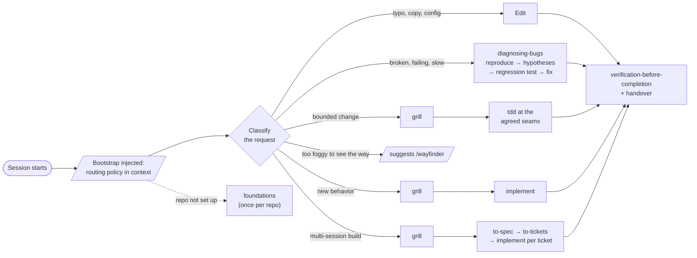
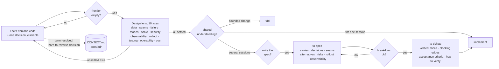
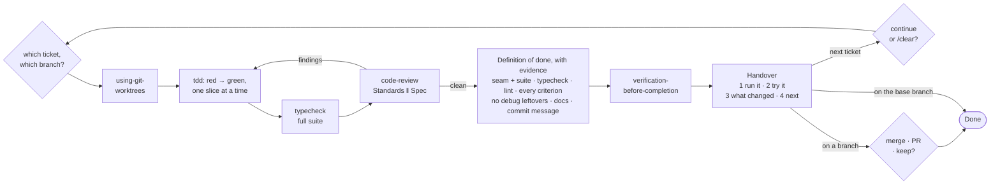

# Seams

**Design at the seams. Build in slices.**

[](CHANGELOG.md) [](plugin/LICENSE) [](docs/plugin-behavior-tests.md)

Seams is a Claude Code plugin (plugin id `matt-pocock-workflow`) that makes [Matt Pocock's engineering skills](https://github.com/mattpocock/skills) lead every session, the way Superpowers does for its own skills: a session bootstrap that routes each development task, a grill that asks one clickable question at a time, gated spec, tickets and implement steps, and a senior-engineer layer around them (design lens, definition of done, handover, repo foundations).

## Try it in 60 seconds

```bash
curl -fsSL https://raw.githubusercontent.com/gabriel-tutor/seams/main/scripts/install.sh | bash
```

Restart Claude Code, open any repo, and say one of these:

| Say | What happens |
| --- | --- |
| *"check what this repo has and what it's missing"* | a foundations survey: run and verify commands, lint, hooks, CI, glossary, boundaries; gaps reported, fixes offered, nothing written without a yes |
| *"X is broken when Y"* | `diagnosing-bugs`: a reproducing loop first, then ranked hypotheses, then a regression test, then the fix |
| *"add <feature>"* | a design grill, one clickable question at a time, until nothing is assumed; then implementation with tests first, review, and a handover |
| *a typo fix* | just the edit |

Nothing is installed except the plugin and Matt Pocock's skills; one command removes it (see [Turning it off](#turning-it-off)).

## The workflow

Every session starts with the routing policy in context. From there, a request goes through three stages: **route**, **design**, **build**. Every diamond is a question Claude asks you, one at a time with the recommended answer first, and waits on. Nothing is built, published or merged without a yes.

### 1. Route: ceremony scales with the change



### 2. Design: the grill, one question at a time



### 3. Build: implement, one ticket at a time



Why this shape works for real software:

- **Design happens before code, and it's interrogated.** The grill won't end while any axis of the design lens is unsettled, so failure modes, rollout and observability get decided while they're still cheap to change. Anything hard to reverse becomes an ADR.
- **Ceremony scales with the change.** A typo is an edit. A bug is a reproducing loop before any fix. A feature is a grill. Only a multi-session build gets a spec and tickets.
- **Every slice is vertical and verifiable.** Tickets are tracer bullets with acceptance criteria and the command that proves them; implementation is red-green at seams you agreed, so tests survive refactors.
- **Review is independent of the author.** Two reviewers, standards and spec, in parallel, before "done".
- **Done has a definition, and you get a handover.** Evidence for every check, then how to run it, what to try, what changed, and what's next.
- **You never have to remember a skill name.** Describe the work; the flow routes it, and each step offers the next one and waits.

The same flow, as a table:


| Request | Path |
| --- | --- |
| Trivial: copy, typo, config, rename | edit, then verify |
| Broken, failing, throwing, slow | `diagnosing-bugs`, then verify and finish |
| Bounded change to existing code | short `grill`, then `tdd`, then verify and finish |
| New behavior that fits one session | `grill` + `domain-modeling`, then `implement`, then verify and finish |
| A build spanning several sessions | grill, then `to-spec`, `to-tickets`, and `implement` one ticket per session |
| Foggy effort, issues someone else wrote, upkeep | Claude suggests `/wayfinder`, `/triage`, `/improve-codebase-architecture` |

Matt Pocock's skills own design, planning, tests, bugs, review and execution. Four Superpowers skills cover what they don't: `using-git-worktrees`, `verification-before-completion` (verify), `finishing-a-development-branch` (finish) and `receiving-code-review`. They ship inside this plugin as unmodified, MIT-attributed copies (`plugin/THIRD_PARTY_NOTICES.md`), so the Superpowers plugin itself is optional. Disable it for a single bootstrap per session, or keep it: Matt Pocock's skills still win every overlap (tested, see below).

Three rules apply on every path: questions go through the clickable question tool with the recommended answer first; test seams are settled in the grill, so `tdd` doesn't ask again; and every chained step (`to-spec`, `to-tickets`, `implement`) asks before it starts and before it publishes anything.

### The senior-engineer layer (2.1)

Matt Pocock's method plus the rigor around it that neither collection carried:

- **Design lens.** Before the grill calls a design complete, it checks ten axes a design review covers: data model, interfaces and seams, failure modes, scale, security boundaries, observability, migration and rollout, testing strategy, operability, cost and reversibility. A bounded change touches three; a multi-session build visits all ten and the answers go into the spec (alternatives considered, risks, rollout, observability).
- **Definition of done.** A ticket isn't done until the seam and full-suite tests pass, typecheck and lint pass, every acceptance criterion is checked one by one, there are no debug leftovers, docs are updated where behavior changed, and the commit says what and why.
- **Handover.** Every ticket ends with four parts: how to run it, what to try per acceptance criterion, what changed (and any decision the ticket didn't settle), and what's next, including whether to `/clear`. Every ticket from `to-tickets` carries a "How to verify" line for the same reason.
- **Foundations.** On first work in a repo, the `foundations` skill surveys run and verify commands, lint, pre-commit hooks, CI, glossary, issue-tracker config, boundary rules and `.env.example`, reports the gaps scaled to the repo's size, and offers to close them through the existing setup skills. It writes nothing without a yes.

## How to use it

### Install (any machine, one command)

```bash
curl -fsSL https://raw.githubusercontent.com/gabriel-tutor/seams/main/scripts/install.sh | bash
```

Read it first if you like: [`scripts/install.sh`](scripts/install.sh). It is safe to re-run, and it does five things, skipping any that are already done:

1. Checks for the `claude` CLI, Node and Python 3.
2. Installs [Matt Pocock's skills](https://github.com/mattpocock/skills) into `~/.claude/skills` with skills.sh (`npx skills add mattpocock/skills`), unless they are there already. The plugin contains none of his skills; it invokes the installed ones by name.
3. Adds this repo as a plugin marketplace from GitHub and installs `matt-pocock-workflow` from it.
4. Adds the Read permission rules the plugin needs to `~/.claude/settings.json`, after backing it up to `settings.json.pre-mpw-install`. The `to-spec`, `to-tickets` and `implement` steps read Matt Pocock's own `SKILL.md`, and the bootstrap points at a reference file inside the plugin; without these rules Claude asks for permission each time.
5. Leaves Superpowers alone. Set `MPW_DISABLE_SUPERPOWERS=1` to disable it for a single bootstrap per session; either way, Matt Pocock's skills win every overlap (tested below).

Then restart Claude Code. Every new session opens with the routing policy, plus two lines computed for that session: where Matt Pocock's skill files are, and a nudge toward `foundations` when the repo has no `docs/agents/issue-tracker.md` yet.

Don't install Matt's official `mattpocock-skills` Claude Code plugin alongside: you'd have every skill twice.

<details>
<summary>By hand, or from a local clone</summary>

```bash
npx skills@latest add mattpocock/skills                         # Matt Pocock's skills, into ~/.claude/skills
claude plugin marketplace add gabriel-tutor/seams
claude plugin install matt-pocock-workflow@my-workflow-agent-skills
claude plugin disable superpowers@claude-plugins-official        # optional
```

Then add to `permissions.allow` in `~/.claude/settings.json`:

```json
"Read(~/.claude/skills/**)",
"Read(~/.claude/plugins/**)"
```

The permission check uses the *resolved* path, so if your `~/.claude/skills/<name>` entries are symlinks (skills-manager resolves to `~/.skills-manager/`, a git clone to wherever you cloned it), add a rule for that target too. `readlink ~/.claude/skills/grilling` shows yours. The installer works this out for you.

To develop the plugin itself, add the marketplace from your clone instead (`claude plugin marketplace add ./seams`). A local-directory marketplace runs the plugin from the clone, not the cache, so it also needs `"Read(//absolute/path/to/clone/plugin/**)"` (the leading `//` makes the rule absolute).

</details>

### Updating

```bash
claude plugin marketplace update my-workflow-agent-skills
claude plugin update matt-pocock-workflow@my-workflow-agent-skills
```

Or re-run the installer, which does the same.

### Once per repo

> *"I'm starting work in this repo. Check what it has and what it's missing."*

That runs `foundations`: a survey of run and verify commands, lint, pre-commit hooks, CI, glossary, issue-tracker config, boundary rules and `.env.example`, with the gaps reported and each fix offered. The one piece only you can run is `/setup-matt-pocock-skills`, which configures the issue tracker (local markdown under `.scratch/` works for solo repos), the triage labels and where `CONTEXT.md` and ADRs live; `to-spec`, `to-tickets`, `code-review` and `triage` read that configuration. The bootstrap reminds you until it exists.

### Then just work

> *"Add gift card support: customers should be able to pay part of an order with a gift card balance."*

Claude invokes the grill before touching anything, asks one question at a time, and offers the next step when the design converges. To confirm it's live, start a fresh session and ask which skill applies to a bug fix; it should name `diagnosing-bugs`.

### Turning it off

```bash
claude plugin disable matt-pocock-workflow@my-workflow-agent-skills
claude plugin enable superpowers@claude-plugins-official
```

## Does it work?

Two kinds of evidence, both reproducible from this repo.

### The right skill fires first, every time

`docs/plugin-behavior-tests.md` records the headless tests behind every wording decision in the plugin, following the RED-GREEN-REFACTOR method from Superpowers' `writing-skills`. Each prompt ran 5 times with the plugin and 5 times without, in fresh copies of a sandbox TypeScript project, and the verdict is the first committing tool call:

| Prompt | Without the plugin | With the plugin |
| --- | --- | --- |
| Overselling bug in `reserve` | edited the source first, 5/5 | `diagnosing-bugs` as the first tool call, 5/5 |
| Two typo fixes | edited, 5/5 | edited, 5/5 (no process skill) |
| Add coupon codes | edited the source first, 5/5 | `grill` as the first tool call, 5/5 |
| Add gift card support | wrote new files after ~100 s of exploring, 5/5 | `grill` as the first tool call, 5/5 |
| Agreed multi-session design, "let's get going" | started writing code, 5/5 | asked "Write the spec now?" before reading anything, 5/5 |

With Superpowers enabled alongside, both bootstraps load and the plugin's guard line gives Matt Pocock's skills every overlap: bug → `diagnosing-bugs` 5/5, feature → `grill` 5/5, typo → edit 3/3, agreed design → the spec gate 3/3, and no run invoked a Superpowers skill.

The senior-engineer layer was tested the same way: `foundations` surveyed a repo and wrote nothing without a yes (3/3), every ticket from `to-tickets` carried a "How to verify" line (9/9), and every `implement` run ended with the four-part handover (3/3).

### A real project, end to end

[`docs/case-study-web-downloader.md`](docs/case-study-web-downloader.md): one feature on a 6,600-line Chrome extension, from the foundations survey through a seven-question grill (which surfaced four design questions the user hadn't asked), the spec, three tickets, and the first ticket's implementation, review and handover. The actual artifacts, in order.

### What it won't do

- It won't skip the questions. On an ambiguous feature request it asks instead of guessing; in headless or unattended runs that means it stops. Give it a spec, or answer the grill.
- It won't run Matt Pocock's user-only skills for you (`/wayfinder`, `/triage`, `/improve-codebase-architecture`); it suggests them by name, and you type them. That is his design and the reason those skills can write to your tracker safely.
- It won't replace judgement. The grill's recommendations are defaults to accept or overrule; the definition of done is a checklist Claude runs, not a guarantee.

## Layout

- `plugin/` — the plugin: `.claude-plugin/plugin.json`, `hooks/` (the SessionStart bootstrap and the gate: `seams_gate.py` plus the PreToolUse, PostToolUse and UserPromptSubmit hooks), `skills/` (bootstrap, `grill` with its design lens, `foundations`, `trivial`, the three flow skills, the four Superpowers copies), `THIRD_PARTY_NOTICES.md`
- `.claude-plugin/marketplace.json` — makes this repo a single-plugin marketplace
- `scripts/install.sh` — the one-command installer; `scripts/behavior_test.py` — the routing-test harness; `scripts/tests/` — the test suites
- `docs/plugin-behavior-tests.md` — routing-test evidence; `docs/case-study-web-downloader.md` — one feature end to end on a real repo; `docs/carousel/` — the workflow as five slides for sharing
- `tests/fixture/`, `tests/scenarios/` — the sandbox project and prompts the routing tests run in

## Tests

```bash
scripts/test.sh                       # every suite below that this machine can run (--fast skips the sandbox one)
scripts/tests/test_plugin.sh          # manifests validate, skills well-formed, Superpowers copies pinned
scripts/tests/test_plugin_hook.sh     # the bootstrap hook against fixture homes and repos
scripts/tests/test_hooks.sh           # the gate hooks fed JSON on stdin (PYTHON=/usr/bin/python3 for the system 3.9)
scripts/tests/test_install.sh         # the installer's settings step, in a fixture home
scripts/tests/test_prepare_run.sh     # the sandbox workspaces the routing tests run in
python3 -m unittest discover -s scripts/tests -p 'test_*.py'   # the gate module and the harness scanner
python3 scripts/behavior_test.py run --scenario concurrency-bug --arm plugin --runs 5   # a routing test, headless
```
